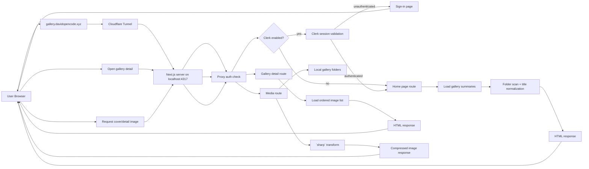
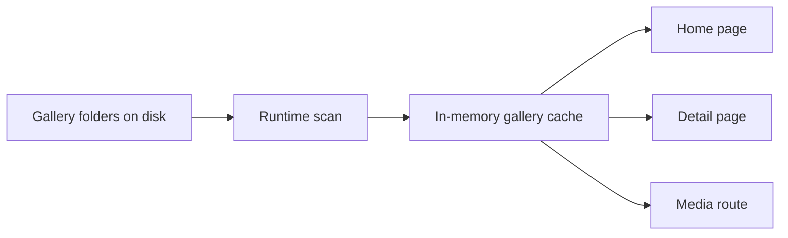

# open-gallery Design Doc

> 最后更新: 2026-04-04 | 维护者: dazhang

## Overview
`open-gallery` 是一个本地优先的 Web App，用来把一批本地图片文件夹直接映射成可浏览的图集库。系统的核心目标不是文件管理，而是让用户在 iPhone 和电脑上都能以“首页封面流进入、详情页连续滚动”的方式顺畅消费整套图片内容。

当前实现已经可以直接读取本地解压后的图集目录，生成封面墙，并通过固定域名 `gallery.davidopencode.xyz` 暴露到公网访问。当前版本已经完成首版前端浏览链路、图片压缩输出、可选的 Clerk 登录保护，以及 Cloudflare Tunnel 对外入口，但尚未引入正式数据库和阅读进度持久化。

## Ultimate Vision
把分散在本地磁盘里的图片图集目录，抽象成一个长期可用、可搜索、可继续阅读、跨设备访问的个人图集浏览系统。

理想终态包括：
- 用户只需要指定一个或多个来源目录，系统即可持续把新的图集文件夹纳入图库。
- 每个图集目录都被当作一份内容资产，而不是普通文件系统层级。
- 用户可以像刷长图流一样阅读整组图片，并保留浏览进度、收藏、已读状态。
- 同一套部署可以稳定服务手机和桌面浏览器，无需额外原生客户端。
- 后续可以逐步扩展到标签聚合、智能封面、隐私控制、家庭大屏展示，以及可选的 `zip` 输入支持。

## Architecture Principles

| Principle | Rationale |
|-----------|-----------|
| Folder-first MVP | 首版先把“一个文件夹 = 一个图集”做稳，降低扫描与读取复杂度。 |
| Browse-first UX | 产品价值来自“连续消费体验”，不是传统文件管理。 |
| Local-first deployment | 用户数据主要在本地磁盘，默认以个人部署和私有使用为前提。 |
| Source abstraction | 领域模型围绕 `gallery source` 设计，后续可再接入 `zip` 等其他来源。 |
| Progressive caching | 缩略图、封面和元数据可以缓存，但缓存必须可重建、可清理。 |
| Mobile parity | iPhone 不是次要端，移动端阅读体验必须和桌面端同等重要。 |
| Optional auth by deployment mode | 开源默认本地模式不应强依赖第三方鉴权；只有公网暴露时才启用统一鉴权。 |

## System Architecture

### Tech Stack

| Layer | Technology | Rationale |
|-------|-----------|-----------|
| Frontend | Next.js App Router + React | 当前已用于首页、详情页、登录页和媒体路由。 |
| Styling | Custom CSS (`app/globals.css`) | 当前版本直接用手写样式控制白粉系视觉和响应式布局。 |
| Authentication | Optional Clerk | 当前支持无鉴权本地模式；配置 Clerk 后再保护登录页、页面和媒体接口。 |
| Backend | Next.js Route Handlers + Proxy | 当前在单仓库内承载页面、媒体输出和全局鉴权。 |
| Source scanning | Node.js filesystem APIs | 文件夹扫描和图片枚举足够直接，适合首版快速落地。 |
| Image delivery | Node file read + `sharp` transform | 当前封面和详情图都通过压缩输出控制体积。 |
| Icon assets | Repo defaults + optional local override | 开源仓库保留默认图标；作者本地可用未提交的 `public/local-icons/` 覆盖。 |
| Runtime metadata | In-memory runtime index | 当前版本仅在进程内缓存图集列表和图片索引，尚未持久化。 |
| Cache storage | Local process cache | 当前只做短 TTL 内存缓存，尚未做磁盘封面缓存。 |
| Public ingress | Optional Cloudflare Tunnel | 作者当前用 named tunnel `gallery` 将固定域名指向本机 `4317`；开源用户可替换为自己的 tunnel。 |
| Deployment | Local production server + optional tunnel helper | 当前可用 `npm run start` 本地运行，也可用 `npm run serve:public` 配合自有 tunnel 对外服务。 |

### Architecture Diagram



### Component Overview

| Component | Responsibility | Status |
|-----------|---------------|--------|
| Optional auth layer | 未配置时跳过鉴权；配置 Clerk 后统一保护页面和图片接口 | ✅ Production |
| Folder scanner | 扫描目录并发现图集文件夹 | ✅ Production |
| Folder indexer | 读取文件夹中的图片文件并建立运行时索引 | ✅ Production |
| Title normalizer | 清洗文件夹名并映射为更自然的中文标题 | ✅ Production |
| Media transformer | 用 `sharp` 输出封面图和详情图压缩版本 | ✅ Production |
| Gallery list UI | 展示图集封面墙 | ✅ Production |
| Gallery detail UI | 提供整组纵向滚动阅读体验 | ✅ Production |
| Public tunnel ingress | 通过用户自有的 Cloudflare named tunnel 暴露固定域名 | ✅ Production |
| Public serve script | 可选的一键启动 build、正式服务与 tunnel helper | ✅ Production |
| Local icon override | 本地私有图标可覆盖仓库默认图标，且不进入 Git | ✅ Production |
| Metadata repository | 持久化图集、收藏、已读、进度等状态 | 📋 Planned |
| Progress and favorites | 记录已读状态、收藏与续读位置 | 📋 Planned |

### Project Structure

```text
open-gallery/
├── app/
│   ├── page.js
│   ├── layout.js
│   ├── globals.css
│   ├── gallery/[slug]/page.js
│   ├── sign-in/[[...sign-in]]/page.js
│   └── api/
│       └── media/[slug]/[index]/route.js
├── components/
│   ├── gallery-card.js
│   └── image-strip.js
├── lib/
│   └── gallery.js
├── scripts/
│   └── serve-public.zsh
├── proxy.js
├── next.config.mjs
├── package.json
├── docs/
│   └── design.md
└── .env.local
```

## Core Interfaces & Data Models

### Core Interfaces

```ts
type GallerySummary = {
  slug: string;
  sourcePath: string;
  sourceType: "folder";
  title: string;
  originalTitle: string;
  imageCount: number;
  updatedAt: number;
  coverIndex: number;
};

type GalleryImage = {
  id: string;
  index: number;
  fileName: string;
  absolutePath: string;
  createdAt: number;
  fileSize: number;
};

type MediaRequest = {
  slug: string;
  index: number;
  mode: "cover" | "detail";
  width?: number;
  quality?: number;
};
```

### Data Models



| Entity | Storage | Notes |
|--------|---------|-------|
| `gallery folders` | Filesystem | 当前真源数据，直接来自本地解压目录。 |
| `runtime gallery cache` | Node process memory | 当前仅做短 TTL 缓存，避免每次请求都重新扫描。 |
| `Clerk session` | Clerk cookies / hosted auth | 仅在启用 Clerk 时用于页面与媒体接口访问控制。 |
| `image transforms` | On-the-fly `sharp` output | 当前未落磁盘缓存，按请求实时生成压缩图。 |

## Feature Status

### ✅ Current Features

| Feature | Description | Notes |
|---------|------------|-------|
| Folder-backed gallery wall | 首页已可展示真实本地图集封面墙 | 标题已做中文清洗和映射。 |
| Detail long-scroll view | 详情页已可顺序滚动浏览整套图片 | 图集内部顺序保持文件名自然排序。 |
| Image optimization route | 封面和详情图已通过 `sharp` 压缩输出 | 首页封面体积已显著下降。 |
| Optional auth protection | 本地模式默认无鉴权；配置 Clerk 后登录页、页面与媒体接口统一受保护 | 当前基于环境变量自动切换。 |
| Public fixed domain | 作者环境中的 `gallery.davidopencode.xyz` 已通过 named tunnel 暴露 | 开源用户可改用自己的 tunnel 名称和域名。 |
| Minimal browse-first homepage | 首页当前仅保留 `Open Gallery`、用户入口和封面流 | 已删除大标题、统计和冗余说明文案。 |

### 🚧 In Progress

| Feature | Description | Target |
|---------|------------|--------|
| UI polish | 首页和详情页仍在继续打磨视觉密度与信息取舍 | 下一轮前端迭代 |
| Stable public access | 当前公网入口可用，但仍依赖本机长驻进程 | 后续考虑守护化或部署化 |

### 📋 Planned

| Feature | Description | Priority |
|---------|------------|----------|
| Reading progress resume | 记住上次浏览位置并支持续读 | P0 |
| Favorites and hide/read state | 收藏图集、标记已读、隐藏图集 | P0 |
| Search and filter | 按角色名、系列名、标签检索图集 | P1 |
| Persistent metadata store | 引入 SQLite 或等价持久化存储状态与索引 | P1 |
| Cover cache on disk | 将高频封面与缩略图持久化到磁盘缓存 | P1 |
| Multi-source organization | 支持多个来源目录与基础筛选 | P2 |
| ZIP source support | 在文件夹方案稳定后补充 `zip` 输入支持 | P2 |
| Tag and series grouping | 按标签、角色、系列聚合多个图集 | P2 |
| Privacy mode | 提供更明确的私密入口和安全开关 | P2 |

## Current Milestone

**目标**: 在已经可用的首版浏览链路上，补齐真正接近产品态的状态管理、搜索能力和部署稳定性。

- [x] 初始化前后端项目骨架
- [x] 实现图集文件夹扫描与运行时索引
- [x] 实现图集列表页
- [x] 实现图集详情页的纵向滚动阅读
- [x] 实现图片压缩输出与基础性能保护
- [x] 实现可选的 Clerk 登录保护
- [x] 实现固定公网域名入口
- [ ] 引入正式元数据持久化
- [ ] 实现阅读进度记录
- [ ] 实现收藏、已读、隐藏状态
- [ ] 实现搜索与筛选
- [ ] 为扫描、媒体输出和核心页面补齐回归测试

## Key Decisions

| Date | Decision | Rationale | Alternatives Rejected |
|------|----------|-----------|----------------------|
| 2026-04-03 | 采用本地优先 Web App 方案 | 同时覆盖 iPhone 与桌面浏览器，降低客户端开发成本 | 原生 iOS App：移动端体验好，但桌面复用差且开发成本高 |
| 2026-04-03 | 首版以文件夹目录作为图集输入源 | 扫描、读取、调试和性能控制都更直接，适合快速交付 MVP | 直接以 `zip` 为首版真源：产品语义自然，但实现复杂度明显更高 |
| 2026-04-03 | 图片原文件保留在本地文件系统，元数据与缓存独立管理 | 保持实现简单，避免过早引入对象存储或远程同步复杂度 | 首版即上云：远程访问能力更强，但成本和复杂度显著上升 |
| 2026-04-04 | 认证采用“本地默认无鉴权 + 公网可选 Clerk” | 更适合开源发布，同时保留公网暴露时的统一鉴权能力 | 强制所有用户配置 Clerk：首跑门槛高；自研密码门：维护成本高 |
| 2026-04-04 | 固定公网域名采用 `gallery.davidopencode.xyz` | 当前 Cloudflare zone 已现成可用，不必迁移其他域名 DNS | 继续用随机 Quick Tunnel：域名不稳定；切换 `creaturelove7.com`：需要 DNS 迁移 |
| 2026-04-04 | 当前元数据先保留在进程内缓存 | 在功能探索阶段先保证浏览链路和 UI 迭代速度 | 立即引入 SQLite：方向正确，但会拖慢首版界面打磨 |
| 2026-04-04 | 标题展示不直接使用目录名 | 目录名包含 `WITH TEXT` 等噪音词，不适合直接作为产品标题 | 完全沿用原目录名：可实现但观感差 |
| 2026-04-04 | 首页收敛为极简封面流 | 当前阶段重点是浏览效率，而不是首页信息展示 | 保留大段 hero、统计和 featured：占空间且干扰浏览 |

## Open Questions

- 来源目录是否需要支持多个根目录，还是先从单目录开始。
- 图集删除语义是“删除索引”还是“隐藏项”；当前假设不直接删除源目录。
- 阅读进度记录应以“最后一张图片”还是“滚动偏移”作为主键语义；MVP 可先同时记录，后续观察。
- 是否需要在 MVP 之后补充 `zip` 输入支持；当前默认先不做。
- Clerk 开发实例后续是否要切到正式生产实例，以及是否需要自定义邮箱/登录策略。
- 当前公网入口依赖本机常驻进程，后续是否要做成开机自启或迁移到正式服务器。
- `serve:public` 是否还要继续扩展为更通用的 provider-agnostic 启动器；当前先只保留 Cloudflare Tunnel helper。
- 图标生成流程后续是否要再拆成“仓库默认资产生成”和“个人本地覆盖资产生成”两条更明确的命令。

## Operations Notes

- 本地开发命令：`npm run dev -- --hostname 0.0.0.0 --port 4317`
- 可选公网启动命令：`TUNNEL_NAME=your-tunnel npm run serve:public`
- 当前固定公网入口：`https://gallery.davidopencode.xyz`
- 当前图片真源目录：`/Users/dazhang/Downloads/gallery/extracted`
- 若仅改页面或样式，通常不需要删除 `.next`；只有环境变量变化或构建缓存异常时才需要清理。

## Changelog

### 2026-04-03
- Initial design doc created from product idea notes and current repository state.
- Defined MVP scope, architecture direction, core entities, and milestone tasks.
- Revised the MVP from zip-first to folder-first and updated the architecture diagram to show end-to-end request and response flow.

### 2026-04-04
- Synced the design doc to the implemented app: Next.js pages, Clerk auth, media route, runtime folder scan, and public tunnel ingress.
- Recorded the fixed public domain, minimal homepage direction, translated gallery titles, and one-command public serve flow.
- Updated the architecture from planned SQLite-first indexing to current in-memory runtime indexing plus on-the-fly image transforms.
- Recorded the fixed public domain strategy, one-command public serve workflow, and Chinese title normalization for gallery display.
